# Starryboardの機能説明

この記事が対象とするStarryboard のバージョン 

> Starryboard v0.x

## アプリウィンドウについて

* Starryboardアプリは複数起動できます。ただし複数ウィンドウから一つのエピソードファイルは開けません。
* １つのエピソードファイルに対する複数ウィンドウ表示は今後対応予定です（特にプレビューウィンドウ）

## エピソード管理ページ

* エピソードファイルを管理します。フォルダを追加して作品シリーズごとに仕分けできます。
* エピソード名の変更・削除は右クリック（タッチ操作の場合はホールドタップ）で表示されるメニューから操作できます
* 並べ替えはページ上部の右から３番目のボタンからできます。手動の並べ替えは非対応です。

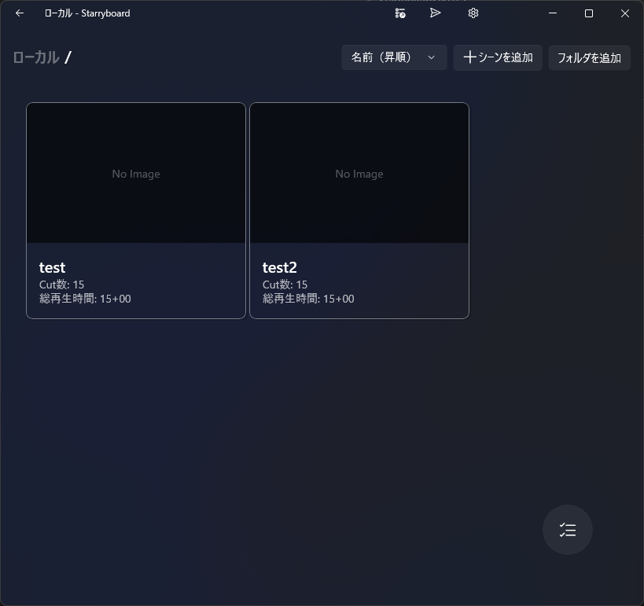


## 設定ページ

設定ページを開くには ウィンドウ右上の歯車アイコンを選択します。

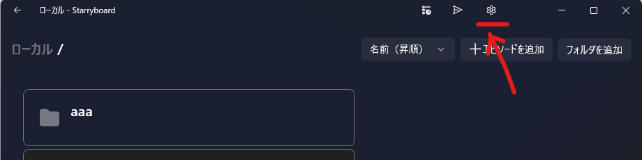

設定ページは一般的なアプリ設定を変更できます。

また、エピソードファイルを開いている状態で設定ページを開くと、カットとキャンバス設定、レイヤーカテゴリ設定、ロール設定を変更できます。

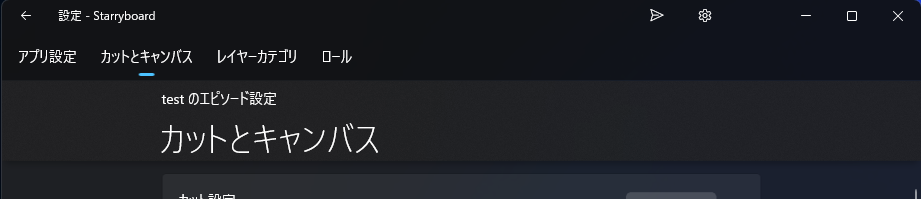

## エクスポートページ

エクスポートページを開くにはエピソードファイルを開いた状態でウィンドウ右上にあるダウンロードアイコンを選択します。

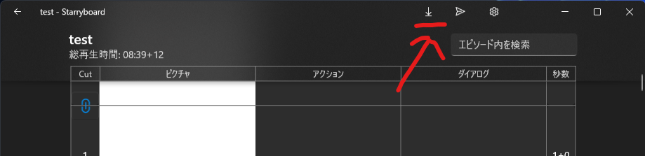

## カット一覧ページ

* エピソードに内包された全てのカットを表示
* セリフなどのテキストと秒数を各カットごとに編集できます
* 絵の部分をクリックするとカット編集ページが開きます
* 画面右下のボタン類からカットの追加・削除・並び替えができます
* シーン区切りを追加することで多数のカットでも任意カットにすぐジャンプできます


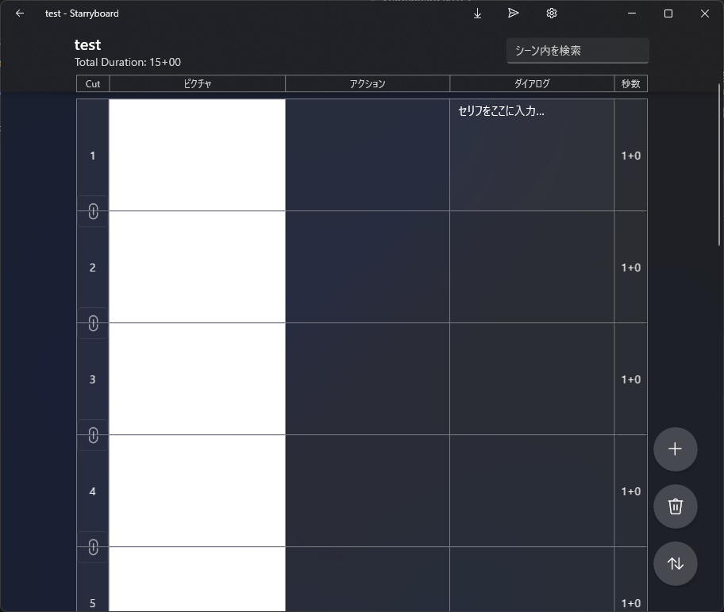

## カット編集ページ

画像に示した番号ごとに説明していきます

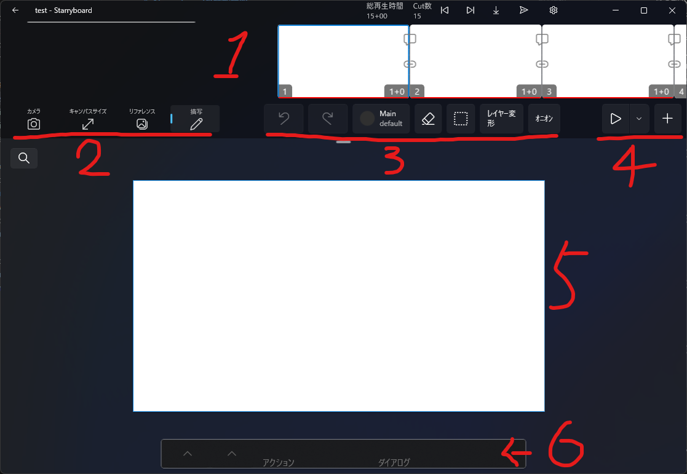

### その１：カットリスト

* エピソードに含まれるカット全てが表示されます
* 青い枠線で囲まれたカットが選択中のカットです。選択中カットがキャンバスに反映され編集できます。
* カットリストのうち赤い下線のあるカットはプレビュー範囲を示します。カットリストをスクロールすると自動でスクロール位置に応じたカットアイテムがプレビュー範囲として設定されます。（詳しくは「その４」で説明しています）
* カットアイテムの間に表示されている「吹き出しアイコン」と「クリップ」のアイコンは
  * 吹き出しアイコンはセリフの接続状態を示します。セリフの接続状態はエクスポート時（特に台本出力時）に参照され、複数カットに跨るが一息で読んでほしい箇所といった指定としてセリフの接続を表現できます。
  * クリップアイコンはカットの接続状態を示します。
    * A. レイヤーカテゴリに共有レイヤーが設定されている場合に接続カット内で画像が共有されます。前景・背景として同じ画像を使いたい場合にレイヤーカテゴリの指定とカット接続を組み合わせて利用します。
    * B. カメラアニメーションを利用した場合に、ひと繋ぎの接続カットが連続編集区間として扱われます。


### その２：表示モード切り替えボタン

キャンバス操作の大きな単位での切り替えます。左から「カメラ」「キャンバスサイズ」「リファレンス」「描写」。

#### カメラ

カットに対するカメラアニメーションを指定します。

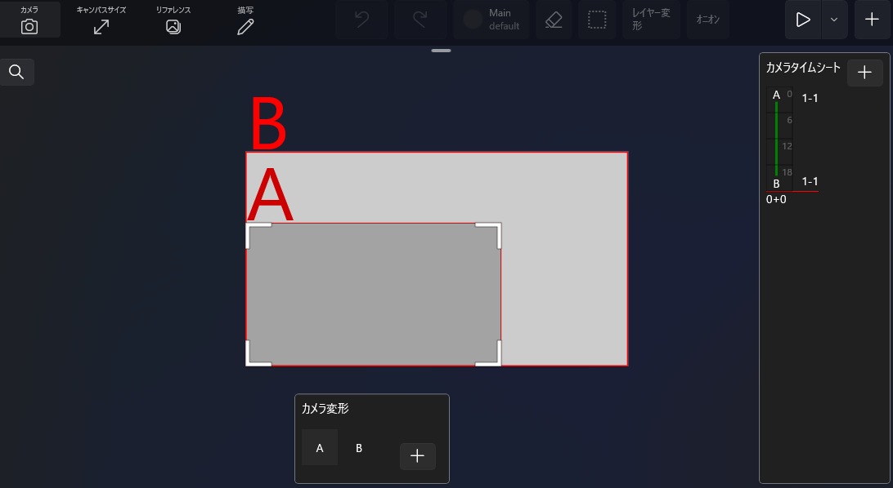

指定は２段階に分かれています

1. 移動元と移動先の変形位置を指定する
2. 変形位置にどのタイミングでなっているのかを示すタイムシートを指定する

#### キャンバスサイズ

カットごとのキャンバスサイズを指定します。
接続カットのキャンバスサイズを変更した場合、接続された全てのカットのキャンバスサイズが同時に変更されます。
エピソード共通のキャンバスサイズは設定画面から確認できます。

#### リファレンス

* ウィンドウキャプチャ：他のアプリウィンドウをStarryboardアプリ内にキャプチャ表示します。３Ｄソフトやブラウザ、写真や動画など自由にアプリ内に表示できます。キャプチャ先ウィンドウの表示に合わせて自動で更新されますが、ちょっぴりGPU使用率が増加します。

* 画像：外部画像を参照します。アプリセッション中のみ画像をメモリに保持します。エピソードファイルには保存されません。

#### 描写

キャンバスを編集するデフォルトの表示モードです。

### その３：キャンバスアクション

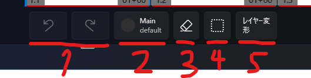

#### １： UndoとRedo

キャンバスに対する変更を１手ずつ戻したり、進めたりできます。

Undo履歴はカット単位で保持しています。選択中カットだけがUndo/Redoの操作対象となります。

全てのUndo履歴はカット編集ページに滞在中のみ保持されます。他のページに移動した時点で全てのUndo履歴は破棄されます。

#### ２：ペン＆レイヤー

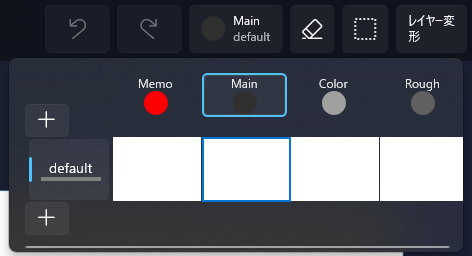


上記画像のMemoやMainと並んでいる部分が「レイヤーカテゴリ」、左側のプラスマークのボタンに挟まれた default とあるのが「レイヤーコンテナ」です。

レイヤーカテゴリは、ペンを内包したレイヤーです。例えば画像の Main は主線レイヤーの意味もありますが、同時にレイヤー選択時に主線のペンも選択されます。

レイヤーコンテナはレイヤーカテゴリとして事前設定された画像レイヤーを一括で管理します。レイヤーコンテナにはロールを指定します。

レイヤーコンテナに指定するロールは例えば、各キャラクターやBOOK（前景）、BG（背景）などが想定されます。

レイヤーカテゴリやレイヤーコンテナ指定するロールは、設定ページから編集できます（アプリウィンドウの右上にある歯車のアイコンからアクセスできます）（レイヤーカテゴリの設定ページを開くと次の画像のように表示されます）。これらの設定はエピソードファイルに保存されます。

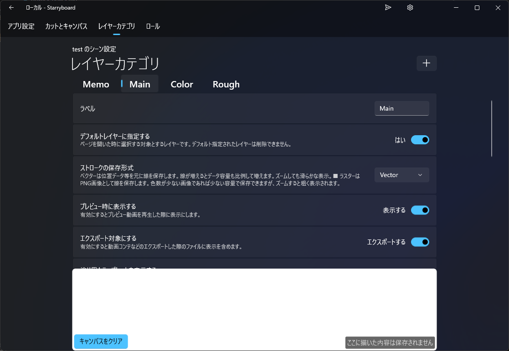

#### ３：消しゴム

* レイヤーがベクターの場合
  * オブジェクト消しゴムとして動作します。一筆で描いた線がまるごと削除されます。
* レイヤーがラスターの場合
  * ピクセル単位で削除されます。

#### ４：範囲選択

#### ５： レイヤー変形

レイヤーコンテナ単位でレイヤー変形を適用します。レイヤーコンテナ内の全てのレイヤーカテゴリのレイヤー画像が変形の影響を受けます。

#### ６：オニオンスキン表示

前後カットのデフォルトレイヤーカテゴリの画像レイヤーを重ねて表示します。

> デフォルトレイヤーカテゴリ以外のレイヤーはオニオンスキン表示できません

### その４：プレビュー再生とカット追加

#### プレビュー再生

プレビュー再生ボタンを押すと動画としてプレビュー再生を開始します。プレビュー再生の設定はプレビュー再生ボタンの右隣にあるドロップダウンボタンからアクセスできます。

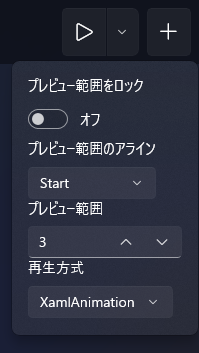

プレビュー再生対象となるカットはカットリストのスクロール位置に応じて自動選択されます。「プレビュー範囲をロック」「プレビュー範囲のアライン」「プレビュー範囲」を操作すると自動選択の挙動を制御できます。

再生方式を Video に変更すると動画ファイルをメモリ内に生成して再生します。動画エンコード処理が挟まるためGPUに負荷が掛かる上に数秒の待ちが生じるため、基本的に XamlAnimation でのプレビュー再生をオススメします。

> 動画ファイル出力（エクスポート）する際は Video方式 と全く同じ処理を利用します。XamlAnimationはVideo方式の生成処理と同等の表示になるよう挙動を模倣するよう作られており、実装をミスした場合に出力結果と一致しないケースがあり得るため、念の為フォールバックとしてVideoが選択できるようになっています

#### カット追加ボタン

右側のプラスアイコンで示されるカット追加ボタンは、押すと選択中カットの次の位置にカットを追加します。新規カットは選択中カットの接続カット状態を引き継いで追加されます。

### その５：キャンバス

### その６：選択中カットの秒数・テキスト編集ボックス

## エクスポートページ

対応しているエクスポート方法は以下の通りです

* 動画コンテ
* 動画字幕
* 絵コンテ
* 台本
* 連番画像

### 動画コンテ

### 動画字幕

### 絵コンテ

### 台本

### 補足：セリフ中の話者名認識の判定条件

絵コンテのセリフにおいてはセリフの頭にキャラ名を書いて改行する形で話者を明示しますが、Starryboardではこの記法に対応してキャラ名とセリフを分離して台本や動画字幕の表示に反映します。


#### 1. ロールに話者認識用ラベルを設定する

設定ページはエピソードファイルを開いた状態でウィンドウ右上の歯車アイコンを選択します。上部タブからロールを選択します。

ロール設定からラベルまたは認識用ラベルに話者名を登録します。

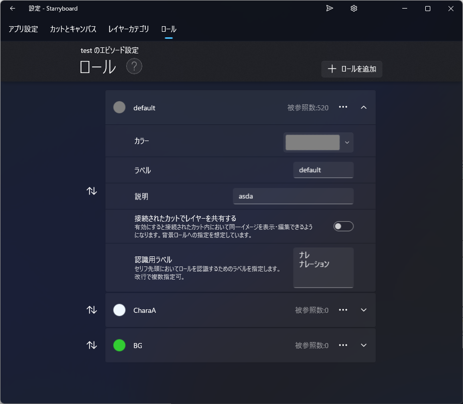

#### 2. ダイアログのセリフに話者名を含ませる

カット一覧ページ、またはカット編集ページ（キャンバスが表示されるページ）からダイアログを編集します。カット編集ページの場合、キャンバス下部にダイアログ等の編集UIが格納されています。

ダイアログに以下のように入力します。

```
ナレ
カット２のテキスト（略）
```

入力すると以下の画像のように出力されます。（実際の表示はEPUBビューアアプリに依存します）

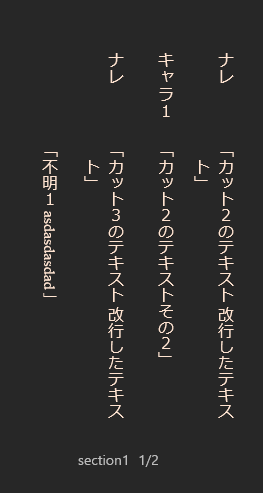

なお、台本エクスポートの設定からセリフ前後に配置する文字を指定できます。日本語の場合は「」が初期設定されます。

### 連番画像


