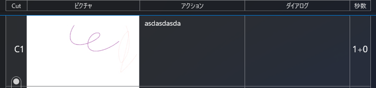
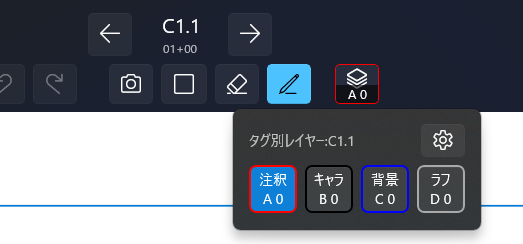
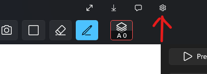
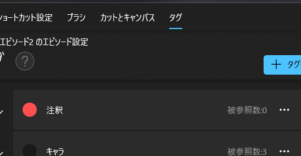
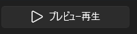
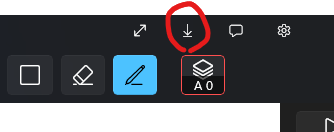

## [Starryboard](/starryboard/about) 

## Starryboardの使い方 クイックスタート

このページではStarryboardを起動してからエピソードを開き、「キャンバスに描く」「プレビュー再生」「セリフを追加」「動画出力」までの流れを一気にご紹介します

### エピソードを開く

アプリを起動したらまず最初にエピソード一覧が表示されます

「サンプルエピソード」と書かれているアイテムをクリックしてエピソードファイルを開いてみましょう。そうするとカットリストが表示されます

### カットリストからキャンバスを開く

カットリストを表示すると、線で区切られたマス目が表示されます。横一行分が１カットを表しています

キャンバスを開くには「C1」と書かれた部分の右隣のマス目（「ピクチャ」の列）を押してください。画面全体にキャンバスが表示されます（この画面から直接描き込むことはできません）

### キャンバスに描く

青枠の内側でクリックしながらポインタを動かすと線が描けます。キャンバス右側の縦長のスライダーを動かすとブラシサイズが変わります

#### レイヤー選択
キャンバス上部の「A0」と表示されたボタンからレイヤー選択できます

選択できるレイヤーはタグ設定に依存します。

#### タグ設定

タグを変更したい場合はウィンドウ右上の歯車アイコンの設定ボタンを押して設定を開き、次に「タグ」タブを選択することでタグを管理できます。

↓

### プレビュー再生

カットリストの上側、またはキャンバス画面の右上にある右向き三角形ボタンを押すとプレビュー画面が開きます

プレビューを閉じるには画面をクリックして一時停止に切り替えた上で左上にある ✖ボタン を押します

キーボードのPキーを押すとプレビュー再生と閉じる操作をショートカットできます

### セリフを追加

カットにセリフを追加すればキャンバスやプレビュー、動画出力時に下部にテキストを表示できます。

カットリストの「ダイアログ」部分をクリックするとテキスト入力できます。適当に「ああああ」などと入力してみてください。その状態でキャンバスやプレビュー画面を開くと、キャンバスの下部にダイアログの内容が反映されていることが確認できます

### 動画出力

アプリウィンドウ右上の下向き矢印ボタンを押すと出力（エクスポート）画面が開きます

動画コンテ項目の右側にあるエクスポートボタンを押すと動作出力が開始されます。完了までお待ちください

完了すると動画ファイルがエクスプローラーに表示されるので任意の動画プレイヤーアプリを使って動画内容をご確認ください

### もっと知る

