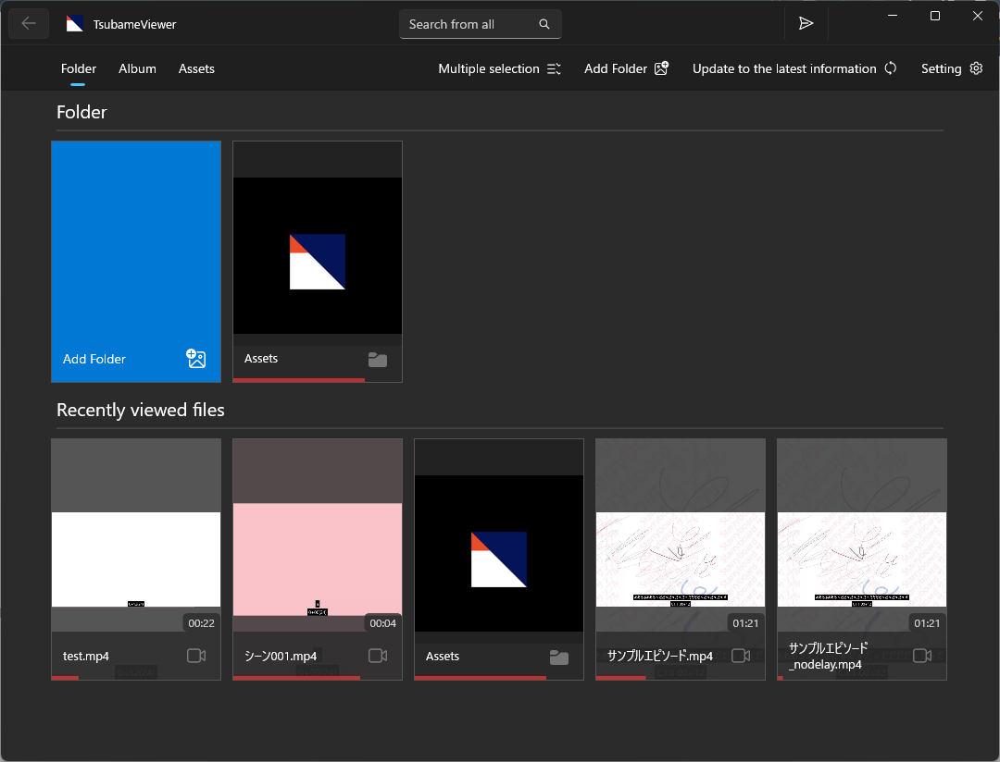
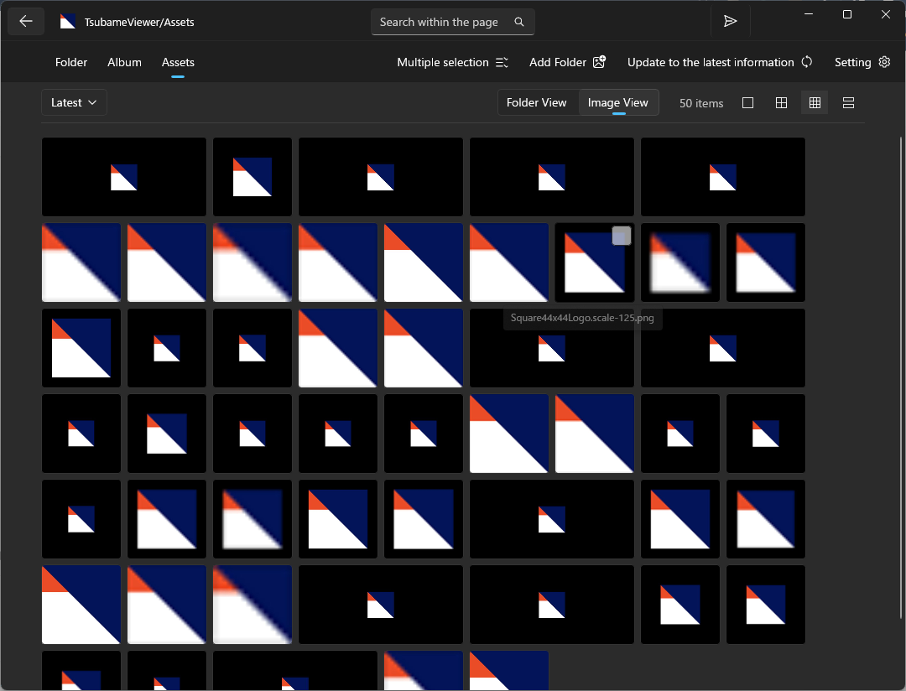
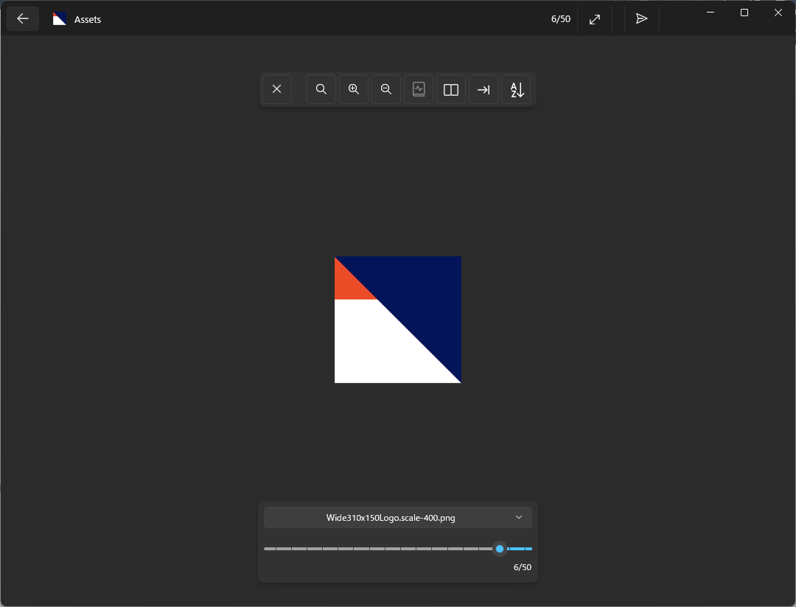
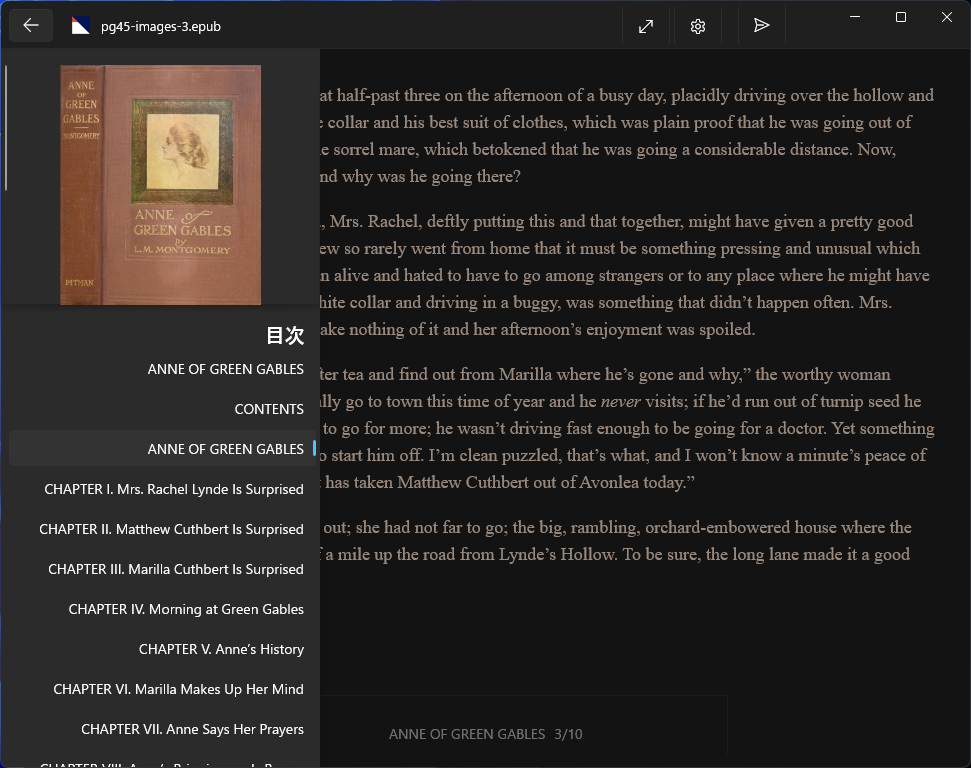
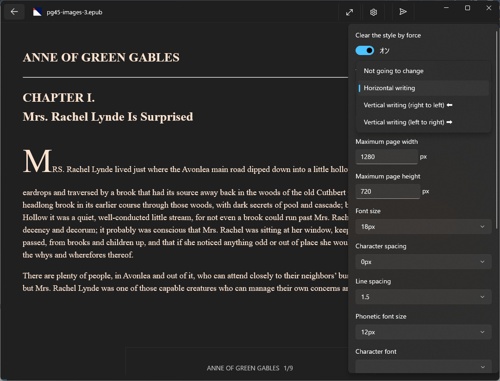
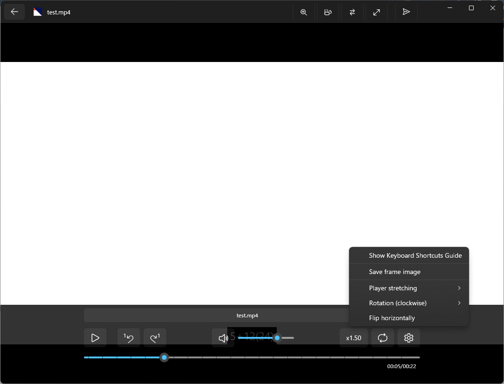

# TsubameViewer

An image, novel, and movie viewer designed exclusively for Windows

## Download

[https://www.microsoft.com/store/apps/9NDXXQRG4PL8](https://www.microsoft.com/store/apps/9NDXXQRG4PL8)

### Supported Platforms

* Windows 11
* Windows 10 (Version 1809 or later required)

## App Overview

* Register a folder in the app to get started
* View images inside compressed files without extracting them to storage
* The image viewer supports two-page spread view
* The novel viewer supports EPUB, and includes a setting to force a reset of display issues
* The movie viewer features a simple UI for easy playback
A screen layout optimized for tablets (the layout remains intact even when displayed on a narrow screen)
* Consistent UI across the entire app
* Fully offline operation (Data communication during app updates is handled by the OS)
* Access all features with no ads and no in-app purchases
* In-app purchases are available as a way to support the development of this app. Please purchase add-ons to support the developer.
* The source code is openly available (see the link below)

## Supported File Formats

* Images
  * .jpg/.png/.bmp/.gif/.tiff/.svg/[.webp](https://apps.microsoft.com/detail/9pg2dk419drg)(*1)/[.avif](https://apps.microsoft.com/detail/9mvzqvxjbq9v)(*1)
* Archives
  * .zip/.cbz/.rar/.cbr/.7z/.cb7/.tar/.pdf
* E-books
  * .epub
* Movie
  * .mp4/.webm/.hevc/.mkv/.avi/.wmv/.ts/.mov/.flv

*1 Requires a separate extension to add codecs

## Features

### Image Viewer

* Supports two-page view
* Pre-loading of previous and next pages
* Zoom in/out
* Swipe left or right to turn pages
* Jump to specific folders within the archive
* Preview display for the page selection slider (a thumbnail appears when you hover over it)
 
### Novel Viewer (EPUB Reader)

* Freely switch between vertical and horizontal text orientation
* Smooth page turning with file pre-loading
* Text adjusts to fit the screen size (supports “reflowable layout”)
* Customize fonts, text size, background color, and more
* Jump to specific chapters or files
* Swipe left or right to turn pages
* Swipe down to display the table of contents
* Swipe up to close the viewer

### Movie Viewer (Video Player)

* Play, pause, and resume playback from a specific point
* Adjust playback speed
* Loop playback
* Move forward or backward by one frame
* Track switching (supports video, audio, and subtitles, as well as external audio and subtitles)
  * Supported external audio formats: .mp3/.m4a/.wma/.wav/.aac/.adts/.flac/.ogg/.oga/.opus
  * Supported external subtitle formats: .srt/.vtt/.ass/.ssa/.txt/.lrc
* Preview display on the seek bar (a thumbnail appears when you hover the mouse over the seek bar)
* Transform the display (flip horizontally, rotate, or scale)
* Background playback
* Swipe left or right to move the playback position
* Swipe up or down to adjust the volume

### Features Common to All Viewers

* Bookmark feature
  * Displays the last viewed position. Automatically resumes playback when reopened
* Displays compressed files directly without extracting them to storage
  * Supported by both the Manga Viewer and Novel Viewer
* Displays viewing progress at the bottom of the screen

### App Features

* Theme switching (OS default / Light / Dark)
* Double-click a file in File Explorer to open it in Tsubame Viewer (launch via file association)
* Drag and drop files or folders into the app to view them in a list or open them in the viewer
* Supports pinning to the Start screen (applies to folders and content displayed in the folder list)
* Filter searches within the displayed folder
  * You can filter Japanese filenames using Romaji input (uses migemo as the underlying technology)
* Search across all folders registered in the app

## Links

* [Source code](https://github.com/tor4kichi/TsubameViewer)
* [TsubameViewer Update History (ja)](./updates)
* [Privacy Policy (ja)](./privacy-policy)
* [Third-Party Library Notices](./Third-Party-Library-Notice)

## Screenshot

