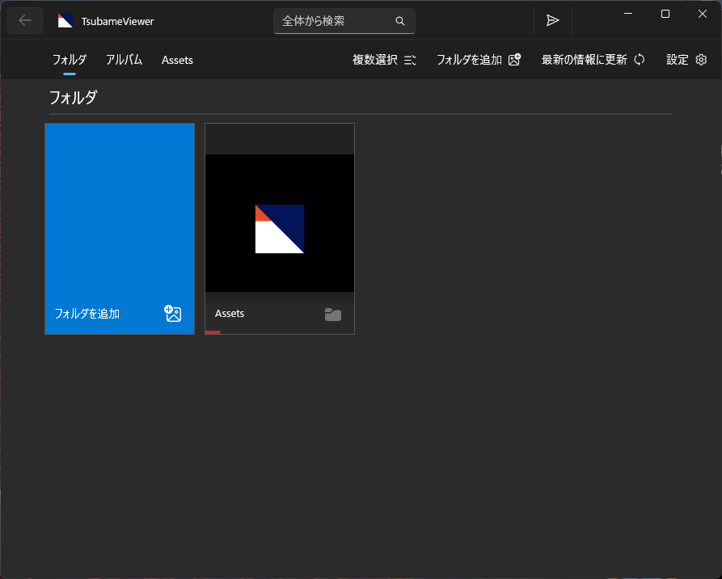
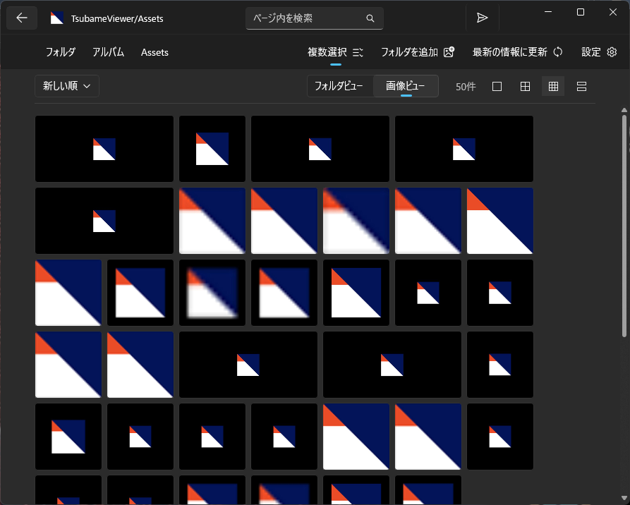
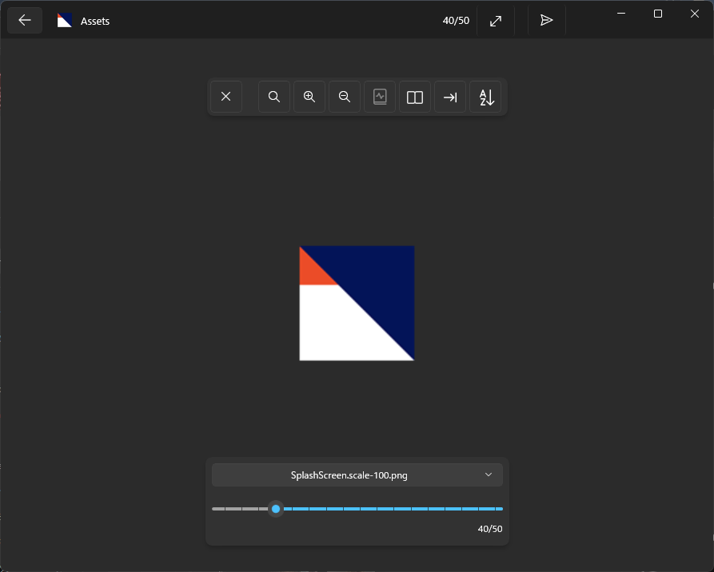
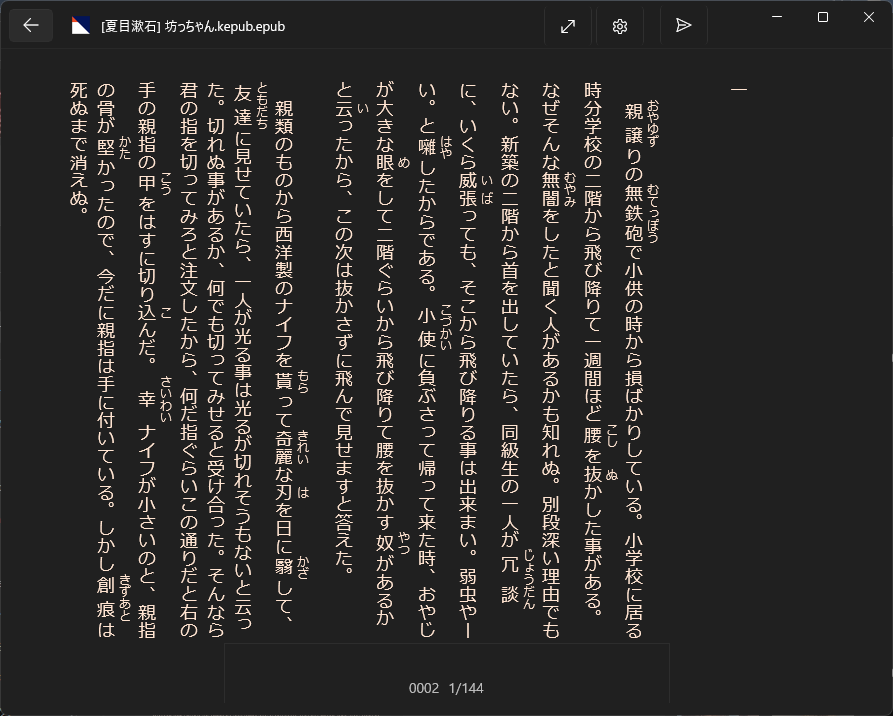
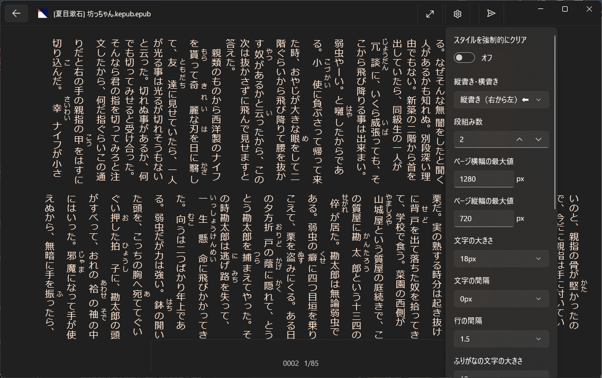
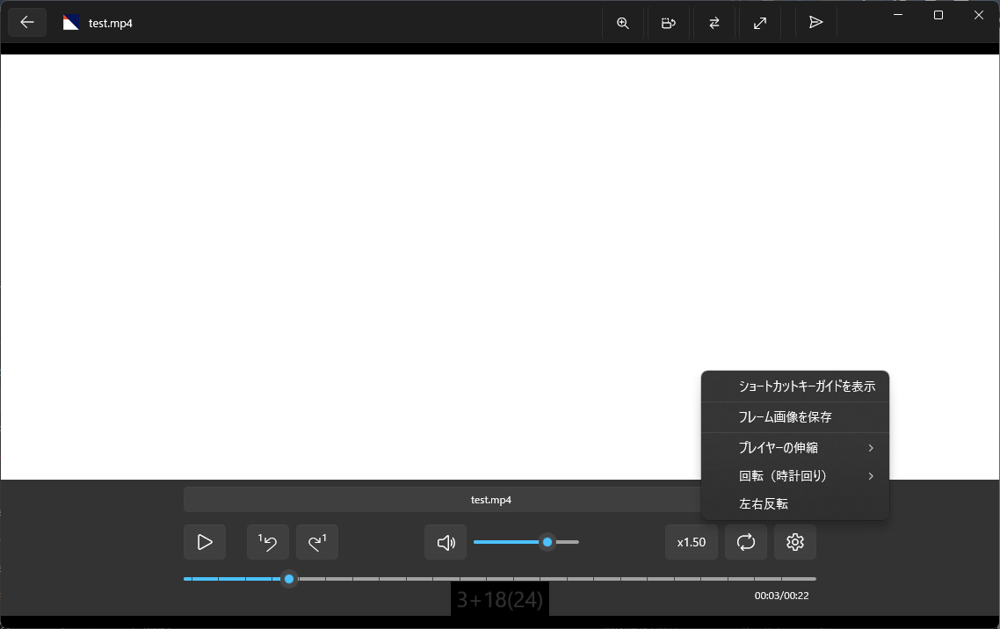

日本語 / [English](./about_en)

## ツバメビューア（TsubameViewer）

Windows専用の画像・小説・動画ビューアです

## ダウンロード

[https://www.microsoft.com/store/apps/9NDXXQRG4PL8](https://www.microsoft.com/store/apps/9NDXXQRG4PL8)

### 対応プラットフォーム

* Windows11
* Windows10 (バージョン1809 以降必須）

## アプリ概要

* フォルダをアプリに登録して利用開始
* フォルダを巡ってビューアで読むまでの流れをサポート
* 圧縮ファイル内の画像をストレージに展開せずに表示
* 見開き表示対応（画像ビューア）
* 縦書き表示に対応（小説ビューア）
* タブレットでの表示・操作に対応

## 対応しているファイル形式

* 画像
  * .jpg/.png/.bmp/.gif/.tiff/.svg/[.webp](https://apps.microsoft.com/detail/9pg2dk419drg)(*1)/[.avif](https://apps.microsoft.com/detail/9mvzqvxjbq9v)(*1)
* アーカイブ
  * .zip/.cbz/.rar/.cbr/.7z/.cb7/.tar/.pdf
* 電子書籍
  * .epub
* 動画
  * .mp4/[.webm](https://apps.microsoft.com/detail/9pg2dk419drg)(*1)/[.hevc](ms-windows-store://pdp/?ProductId=9n4wgh0z6vhq)(*1)

*1 別途コーデックを追加する拡張機能が必要です

## 機能紹介

### 画像ビューア

* 見開き表示に対応
* 前後ページの先行読み込み
* 拡大縮小
 
### 小説ビューア

* 縦書き・横書きに対応
* テキストを画面サイズに応じて表示（いわゆる「リフロー型表示」に対応）
* フォントや文字サイズ、背景色などの自由な変更
* 章のジャンプに対応

### 動画ビューア

* 左右反転
* 再生速度変更
* ループ再生
* 1フレームの前後移動
* バックグラウンド再生
* 左右スワイプで再生位置移動
* 上下スワイプで音量変更

### ビューア共通の機能

* しおり機能
  * 前回見ていた位置を表示。再度開いたら自動で復帰
* 圧縮ファイルをストレージに展開せずそのまま表示
  * 漫画ビューア・小説ビューアどちらも対応
* 視聴進捗率を画面下部に表示

### アプリの機能

* エクスプローラーなどからのファイル拡張子の関連付け起動に対応
* ドラッグ＆ドロップによるファイルやフォルダを開く動作に対応
* スタート画面へのピン留めに対応
* 表示フォルダ内のフィルタ表示
* アプリに登録したフォルダ全体からの検索

## リンク

* [ツバメビューアの更新履歴](./updates)
* [プライバシーポリシー](./privacy-policy)
* [サードパーティライセンスの権利表記](./Third-Party-Library-Notice)

## スクリーンショット

