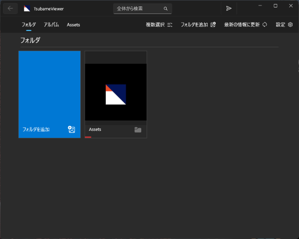
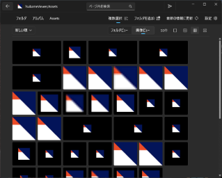
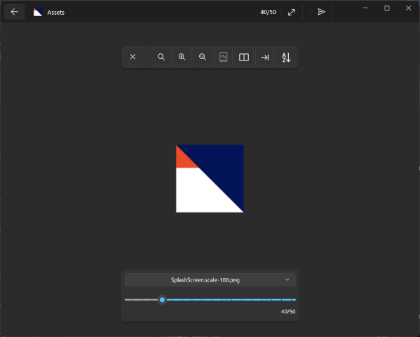
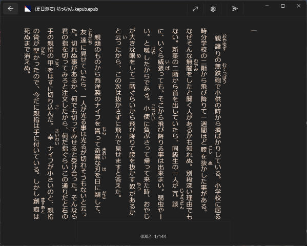
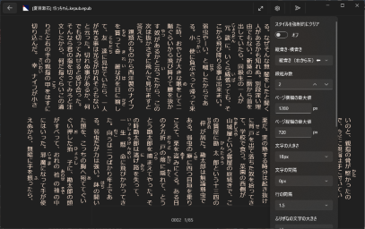
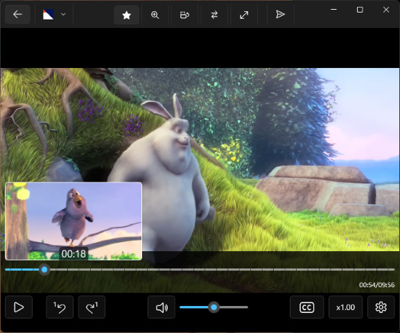

# ツバメビューア

Windows専用の画像・小説・動画ビューアです

## ダウンロード

[https://www.microsoft.com/store/apps/9NDXXQRG4PL8](https://www.microsoft.com/store/apps/9NDXXQRG4PL8)

### 対応プラットフォーム

* Windows11 or Windows10 （バージョン1809 以降必須）
* x64/x86/arm64 のいずれにも対応

## アプリ概要

* エクスプローラーからツバメビューアを指定してファイルを開く、またはファイルをツバメビューアにドラッグ＆ドロップして利用を開始
* アプリにフォルダを登録するとより便利にご利用いだたけます
  * 画像や動画だけでなくEPUBやzipのサムネイル画像も表示
  * 日本語タイトルのファイル名をローマ字入力で絞り込み検索できます
  * コンテンツの視聴済み表示
  * 視聴履歴の表示
* タブレットでの表示・タッチ操作に対応
  * 画面サイズの違いや画面の回転に対応したレスポンシブなUI
  * 「アプリ起動時に全画面表示」を設定できます
* 完全オフライン動作
* 広告無し・課金無しですべての機能にアクセスできます
* 開発支援アドオンとしてアプリ内課金があります
* [ソースコードが公開されています - github.com](https://github.com/tor4kichi/TsubameViewer)

## 対応しているファイル形式

* 画像
  * .jpg/.png/.bmp/.gif/.tiff/.svg/[.webp](https://apps.microsoft.com/detail/9pg2dk419drg)(*1)/[.avif](https://apps.microsoft.com/detail/9mvzqvxjbq9v)(*1)
* アーカイブ（画像）
  * .zip/.cbz/.rar/.cbr/.7z/.cb7/.tar/.pdf
* 電子書籍
  * .epub
* 動画
  * .mp4/.webm/.hevc/.mkv/.avi/.wmv/.ts/.mov/.flv

*1 別途コーデックを追加する拡張機能が必要です

## 機能紹介

### ビューア共通の機能

* しおり機能
  * 見ていた位置を記録。再度開いたら自動で復帰
* 圧縮ファイルをストレージに展開せずそのまま表示
  * 画像ビューア・小説ビューアどちらも対応
* 視聴進捗率を画面下部に表示
* 前後コンテンツの検出と自動的な次コンテンツへの移動
* 別ウィンドウにビューアを表示

### 画像ビューア

* 見開き表示に対応
* 前後ページの先行読み込み
* 表示の変形（ズーム切替・位置の変更）
* 左右スワイプでページ送り
* アーカイブ内のフォルダ単位のジャンプ
* ページ選択スライダーのプレビュ―表示（マウスを載せると縮小画像表示）

### 小説ビューア （EPUBリーダー）

* 縦書き・横書きを自由に表示切替
* ファイルの先読みによるスムーズなページ送り
* テキストを画面サイズに応じて表示（いわゆる「リフロー型表示」に対応）
* フォントや文字サイズ、背景色などの自由に変更
* 章やファイルのジャンプに対応
* 左右スワイプでページ送り
* 下スワイプで目次表示
* 上スワイプでビューアを閉じる

### 動画ビューア （動画プレイヤー）

* 再生・一時停止・指定位置から再生
* 再生速度変更
* ループ再生
* 1フレームの前後移動
* トラック切り替え（映像・音声・字幕、及び外部音声・外部字幕に対応）
  * 外部音声対応形式：.mp3/.m4a/.wma/.wav/.aac/.adts/.flac/.ogg/.oga/.opus
  * 外部字幕対応形式：.srt/.vtt/.ass/.ssa/.txt/.lrc
* シークバーのプレビュー表示（シークバーにマウスを乗せると縮小画像表示）
* 表示の変形（左右反転・回転・ズーム切替・位置の変更）
* 映像効果（明るさ・コントラスト・彩度）
* バックグラウンド再生
* 左右スワイプで再生位置移動
* 上下スワイプで音量変更

### アプリの機能

* テーマ切替（OSデフォルト/ライト/ダーク）
* エクスプローラーでファイルをダブルクリックしてツバメビューアで表示できます（関連付け起動）
* ファイルやフォルダをアプリにドラッグ＆ドロップして一覧表示したりビューアに表示できます
* スタート画面へのピン留めに対応（フォルダ一覧に表示されるフォルダやコンテンツが対象）
* 表示フォルダ内の絞り込み検索
  * ローマ字入力で日本語のファイル名も絞り込み可能（内部技術として migemo を利用）
* アプリに登録したフォルダ全体からの検索

## リンク

* [ソースコード](https://github.com/tor4kichi/TsubameViewer)
* [ツバメビューアの更新履歴](./updates)
* [プライバシーポリシー](./privacy-policy)
* [サードパーティライセンスの権利表記](./Third-Party-Library-Notice)

## スクリーンショット

### 登録フォルダ一覧

### 画像一覧

### 画像ビューア

### 小説ビューア

### 小説ビューアの設定

### 動画ビューア

