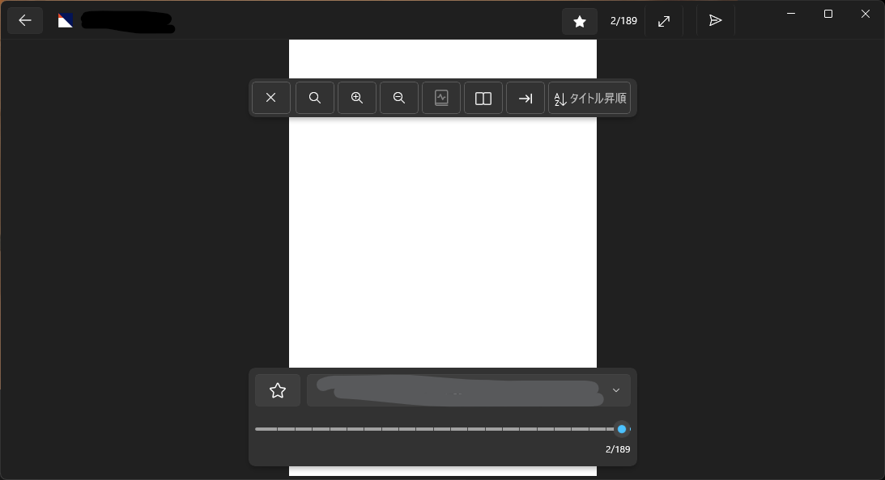

# ツバメビューアの使い方

目次
* [フォルダを登録しよう](#フォルダを登録しよう)
  * [エクスプローラーからファイルを開く](#エクスプローラーからファイルを開く)
* [フォルダとコンテンツを一覧表示](#フォルダとコンテンツを一覧表示)
* [画像を一覧表示](#画像を一覧表示)
* [漫画ビューアを使う](#漫画ビューアを使う)
* [小説ビューアを使う](#小説ビューアを使う)
* [動画ビューアを使う](#動画ビューアを使う)
  * [短い動画のループ再生の自動有効化](#短い動画のループ再生の自動有効化)
* [フォルダ内の絞り込み検索](#フォルダ内の絞り込み検索)
  * [ローマ字入力で日本語ファイル名を絞り込み](#ローマ字入力で日本語ファイル名を絞り込み)
* [登録フォルダ全体を検索](#登録フォルダ全体を検索)
* [複数選択（と別フォルダへの移動）](#複数選択と別フォルダへの移動)
* [お気に入り登録と表示切替](#お気に入り登録と表示切替)
* [コンテンツの読了率](#コンテンツの読了率)
  * [フォルダの読了数表示](#フォルダの読了数表示)

## ざっくりとした概要

* アプリにフォルダを登録して使い始めよう
* フォルダを選択するとサブフォルダ、画像、画像圧縮ファイル、EPUB、動画ファイルを表示できる
* 画像圧縮ファイルなどコンテンツをクリックするとビューアで開くことができる
* 画像、小説、動画それぞれに適したビューアが表示される。画面中央（小説は画面中央の下部）をクリックするとコントロールUIの表示を切り替えられる
* ウィンドウ左上の戻るボタン、またはビューア内の閉じるボタン、ESCキーを押すことでビューアを閉じられる

## フォルダを登録しよう

最初に表示される画面にある「フォルダを追加」を選択するところから始めましょう。

登録できたら、そのフォルダを選択することでフォルダ一覧画面が開いてコンテンツを表示できます。

> Tips: 登録フォルダはドラッグ＆ドロップで並び替えできます

> Q. フォルダ登録が必要な理由を教えて
> 
> A. ツバメビューアはユーザーのセキュリティを確保するためにファイルアクセス権限を持たせていません。ユーザーが「このフォルダは使っていいよ」「このファイルはアクセスしていいよ」と渡してもらったコンテンツにだけアクセスできる厳密なルールの元で動作しています。

### エクスプローラーからファイルを開く

エクスプローラーの「プログラムから開く」でツバメビューアを選択したり、ファイルやフォルダをツバメビューアにドラッグ＆ドロップしても開けます。

## フォルダとコンテンツを一覧表示

登録したフォルダを選択すると「フォルダ一覧」が表示されます。

フォルダ一覧では、サブフォルダやコンテンツ（＝作品）を一覧表示する画面です。アプリが対応する画像を含む圧縮ファイル（雑誌や漫画など）、EPUB（小説）、動画をコンテンツとして表示できます。

サブフォルダを開く方法は「ビューアで開く」がデフォルトです。

画像一覧またはフォルダ一覧で開きたい場合は、フォルダのオプション（三つの点々が表示されたボタン）から「子フォルダ（画像）の開き方」を「一覧で開く」を選択しましょう。（各フォルダごとに選択が保持されます）

## 画像を一覧表示

フォルダ一覧から画像が含まれるフォルダ、または画像を含む圧縮ファイルを選択するとリスト表示されます。

> Tips: フォルダ内のアイテムのサムネイル画像は開いた時点で作成され始めます

> Tips: サムネイル画像の生成に関する設定は「アプリ設定（アプリメニューの右端にある歯車アイコン）」から変更可能です。（サムネイル生成の有無や画質など）

表示サイズを変更したい場合は画面右上の表示粒度を示す図形アイコンを切り替えましょう。

左から画像を大きく表示、中くらいで表示、小さく表示、そして一番右はファイル名のみを表示します。

画面左上から並べ替えを切り替えられます。

「未指定」を選択すると、親フォルダ方向で指定された「子フォルダ内アイテムの並び順」を並び替えに反映します。

## 漫画ビューアを使う

フォルダ一覧から「ビューアで開く」を選択したり、画像一覧で画像を選択すると、画像ビューアが表示されます。

画面の左右をタップするとページ移動できます。

画面中央をタップするとメニューが表示されます。

メニュー上部のボタンは、左から「閉じる」「拡大縮小リセット」「１段階拡大」「一段階縮小」「見開きページ補正」「見開き表示」「左開き表示」「並び替え」です。

見開き表示はデフォルトで「右開き表示」ですが、アプリ設定画面から左開き表示をデフォルトに変更可能です。（アプリ設定はビューアを閉じて、メニューの一番右端にある設定ボタン（歯車アイコン）を選択すると表示できます）

画像ビューアの並び替えを変更すると、画像一覧での並び替えも一緒に変わります。

> Tips: マウスのセンタークリック、またはキーボードのF11キーで全画面表示を切り替えられます

> Tips: Ctrlキー＋マウスホイールでズームできます

## 小説ビューアを使う

フォルダ一覧からEPUBファイルを開くと小説ビューア（EPUBリーダー）が表示されます。

画面下側のタイトルとページ番号が書かれた部分をタッチすると、目次が表示されます。

ページ移動を移動するには、画面の左右部分をタッチ（クリック）するか、キーボードの左右キーを押す。または左右にスワイプすると移動できます。

画面中央部分で上方向にスワイプするとビューアを閉じて、前の画面に戻ります。下方向にスワイプすると目次が開きます。

ビューア内の設定からは様々なオプションを変更可能です。

表示の上から「スタイルの強制的にクリア」「先読みを有効化」「縦書き・横書き」「段組み数」「ページ横幅の最大値」「ページ縦幅の最大値」「文字の大きさ」「文字の間隔」「行の間隔」「ふりがなの文字の大きさ」「文字のフォント」「ふりがなの文字のフォント」「背景色」「文字色」「スクロールのページ送りを逆にする」「左右のページ送りを逆にする」「スワイプのページ送りを逆にする」が変更可能です。

## 動画ビューアを使う

フォルダ一覧から動画アイテムを選択すると動画ビューア（動画プレイヤー）が表示されます。

動画ビューアの下部にはコントロールUIがあります。その上側には再生位置を指定するシークバーがあり、下側には再生を管理するボタンがあります。ボタンは左から「再生・一時停止切替」「１フレーム戻る」「１フレーム進む」「消音（ミュート）切替」「音量スライダー」「字幕切替」「再生速度変更」「動画ビューア内設定」が並んでいます。

動画ビューアの上部、ウィンドウバーにもプレイヤー表示を制御するボタンがあります。左から「動画コンテンツのお気に入り切替」「伸縮表示切替」「回転切替」「左右反転切替」「全画面表示切替」があります。

プレイヤー部分を上下にスワイプすると音量を変更できます。左右にスワイプすると再生位置を移動できます。

シークバーにマウスやペンのポインターを乗せるとプレビューが表示されます。

タッチ操作の場合はシークバーをタッチしてから離すまでの間プレビューが表示され、シークバーの中でタッチを離すと再生位置が移動し、シークバーの外でタッチを離すと再生位置の移動をキャンセルできます。

プレイヤー上でマウスホイールを動かすと音量を変更できます。

### 短い動画のループ再生の自動有効化

１分以下の短い動画は自動的にループ再生されます。この設定をOFFにしたり、短い動画を判定する時間の長さを変更したい場合は、アプリ設定を開いて変更してください。

アプリ設定は動画ビューアを閉じて、アプリメニューの右端にある設定ボタンから開くことができます。

## フォルダ内の絞り込み検索

フォルダとコンテンツの一覧ページ、および画像一覧ページではウィンドウバーにある絞り込み検索ボックスからフィルター表示を指定できます。

検索対象はファイル名のみです。

### ローマ字入力で日本語ファイル名を絞り込み

例えば「saku」と入力すれば「さく」「桜」「作者」など日本語の読み仮名を含むファイル名も絞り込みできます。

## 登録フォルダ全体を検索

絞り込み検索時のポップアップから「全体から検索」を選択すると、アプリに登録したすべてのフォルダを対象に検索できます。

## 複数選択（と別フォルダへの移動）

複数選択を行うには、アプリメニューの複数選択を押したり、リストアイテムをCtrlキー＋クリック、あるいはリストアイテム右上の選択ボックスを押すと複数選択できます。

複数選択したアイテムは、別フォルダへの移動、削除ができます。

## お気に入り登録と表示切替

ファイルやフォルダをお気に入りに登録して、一覧したり、リスト表示時にお気に入りのみを表示したりできます。

お気に入りに登録するには、リストアイテムのメニューを開いて「お気に入りに登録」を選択するか、各種ビューアのウィンドウバーに表示されている星形アイコンのボタンを押すと、お気に入りに登録（もう一度押すと登録解除）できます。

お気に入り登録されたリストアイテムは左上にアクセントカラーのリボンが表示されます。

リストページ上部の「お気に入りのみ」を選択すると、お気に入りだけを表示できます。

## コンテンツの読了率

各種ビューアの下部やフォルダ一覧のアイテム下部には読了率を示すゲージが表示されます。読了率は画像圧縮ファイル、EPUB、動画のファイルに対して表示されます。（フォルダは読了数を表示するためゲージは表示されません）

読了した判定は「しきい値」を基準にします。例えば動画は全体の再生時間の90%まで視聴したら読了したと判定されます。判定条件の数値はアプリ設定から変更できます。

### フォルダの読了数表示

フォルダには、フォルダに含まれるコンテンツの読了した数とコンテンツの数が表示されます。

フォルダ一覧のフォルダアイテムに読了数を表示したくない場合は、アプリ設定から「フォルダの読了数を表示する」を変更することで表示を消せます。

