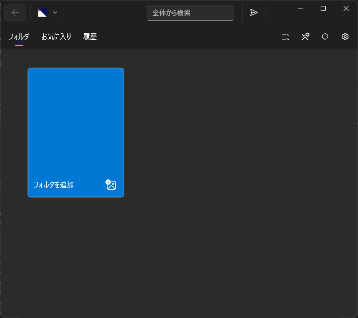
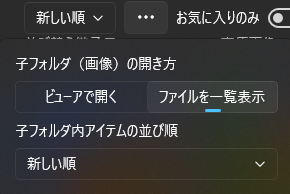
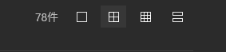
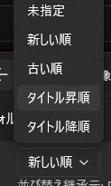
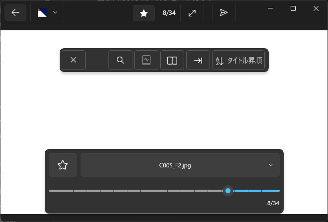
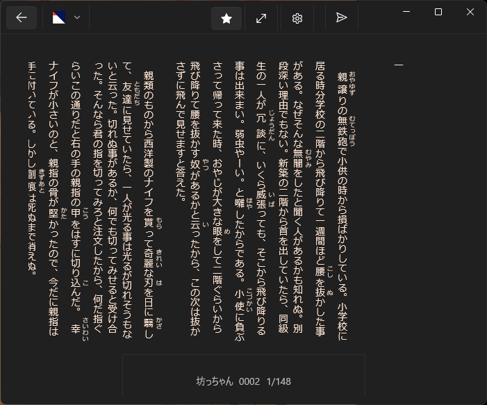
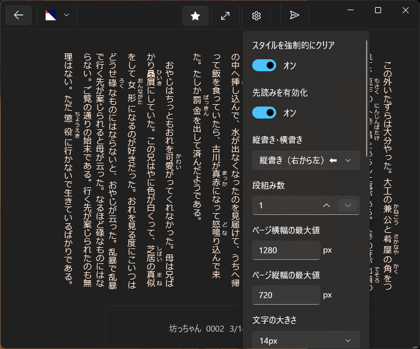
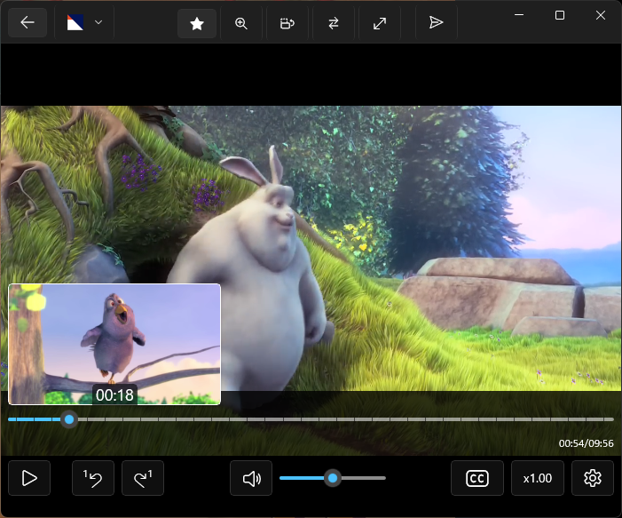

# ツバメビューアの使い方

目次
* [フォルダを登録しよう](#フォルダを登録しよう)
  * [エクスプローラーからファイルを開く](#エクスプローラーからファイルを開く)
* [フォルダとコンテンツを一覧表示](#フォルダとコンテンツを一覧表示)
* [画像を一覧表示](#画像を一覧表示)
* [画像ビューアを使う](#画像ビューアを使う)
* [小説ビューアを使う](#小説ビューアを使う)
* [動画ビューアを使う](#動画ビューアを使う)
  * [トラック切替（映像・音声・字幕）](#トラック切替映像音声字幕)
  * [短い動画のループ再生の自動有効化](#短い動画のループ再生の自動有効化)
* [ビューアでの前後コンテンツの検出](#ビューアでの前後コンテンツの検出)
  * [次コンテンツへの自動移動](#次コンテンツへの自動移動)
* [コンテンツの読了率](#コンテンツの読了率)
  * [フォルダの読了数表示](#フォルダの読了数表示)
* [ページ内の絞り込み検索](#ページ内の絞り込み検索)
  * [ローマ字入力で日本語ファイル名を絞り込み](#ローマ字入力で日本語ファイル名を絞り込み)
* [登録フォルダ全体を検索](#登録フォルダ全体を検索)
* [複数選択](#複数選択)
* [お気に入り登録と表示切替](#お気に入り登録と表示切替)

## ダウンロードとインストール

マイクロソフトストアのツバメビューアページからダウンロード＆インストールできます

[https://www.microsoft.com/store/apps/9NDXXQRG4PL8](https://www.microsoft.com/store/apps/9NDXXQRG4PL8)

## ざっくりとした概要

* アプリにフォルダを登録して使い始めよう
* フォルダを選択するとサブフォルダ、画像、画像圧縮ファイル、EPUB、動画ファイルを表示できる
* 画像圧縮ファイルなどコンテンツをクリックするとビューアで開くことができる
* 画像、小説、動画それぞれに適したビューアが表示される。画面中央（小説は画面中央の下部）をクリックするとコントロールUIの表示を切り替えられる
* ウィンドウ左上の戻るボタン、またはビューア内の閉じるボタン、ESCキーを押すことでビューアを閉じられる

## フォルダを登録しよう

最初に表示される画面にある「フォルダを追加」を選択するところから始めましょう。

登録できたら、そのフォルダを選択することでフォルダ一覧画面が開いてコンテンツを表示できます。

> Tips: 登録フォルダはドラッグ＆ドロップで並び替えできます

> Q. フォルダ登録が必要な理由を教えて
> 
> A. ツバメビューアはユーザーのセキュリティを確保するためにファイルアクセス権限を持たせていません。ユーザーが「このフォルダは使っていいよ」「このファイルはアクセスしていいよ」と渡してもらったコンテンツにだけアクセスできる厳密なルールの元で動作しています。

### エクスプローラーからファイルを開く

エクスプローラーの「プログラムから開く」でツバメビューアを選択したり、ファイルやフォルダをツバメビューアにドラッグ＆ドロップしても開けます。

## フォルダとコンテンツを一覧表示

登録したフォルダを選択すると「フォルダ一覧」が表示されます。

フォルダ一覧は、サブフォルダやコンテンツ（＝作品）を一覧表示する画面です。アプリが対応する画像を含む圧縮ファイル（雑誌や漫画など）、EPUB（小説）、動画をサムネイル画像と共に表示します。

画像を含んだサブフォルダは「ビューアで開く」が開く動作のデフォルトです。アイテムを右クリックして「一覧で開く」を選択することもできます。

フォルダ内のサブフォルダを常に「一覧で開く」に指定したい場合は、フォルダのオプション（三つの点々が表示されたボタン）から「子フォルダ（画像）の開き方」を「一覧で開く」に切り替えましょう。（フォルダごとに選択状態が保持されます）

## 画像を一覧表示

フォルダ一覧から画像が含まれるフォルダ、または画像を含む圧縮ファイルを選択して「ファイル一覧を表示」として開かれた場合にリスト表示されます。

> Tips: フォルダ内のアイテムのサムネイル画像は開いた時点で作成され始めます

> Tips: サムネイル画像の生成に関する設定は「アプリ設定（アプリメニューの右端にある歯車アイコン）」から変更可能です。（サムネイル生成の有無や画質を指定できます）

画像アイテムの表示サイズを変更したい場合は画面右上の表示粒度を示す図形アイコンを切り替えましょう。

左から画像を大きく表示、中くらいで表示、小さく表示、そして一番右はファイル名のみを表示します。

画面左上から並べ替えを切り替えられます。

「未指定」を選択すると、親フォルダ方向で指定された「子フォルダ内アイテムの並び順」を並び替えに反映します。

## 画像ビューアを使う

フォルダ一覧から「ビューアで開く」を選択したり、画像一覧で画像を選択すると、画像ビューアが表示されます。

画面の左右をタップするとページ移動できます。

画面中央をタップするとメニューが表示されます。

メニュー上部のボタンは、左から「閉じる」「変形編集」「見開きページ補正」「見開き表示」「左開き表示」「並び替え」です。

「変形編集」を選択すると変形編集モードに切り替わります。拡大縮小したり画像の位置を変更することで画像を写し方を変えられます。リセットを押すとデフォルトの拡大率と位置に戻ります。完了を押すと変形編集モードを終了します。変形編集中は画面左右端を押してのページ送りが無効になります。

見開き表示はデフォルトで「右開き表示」ですが、アプリ設定画面から左開き表示をデフォルトに変更可能です。（アプリ設定はビューアを閉じて、メニューの一番右端にある設定ボタン（歯車アイコン）を選択すると表示できます）

画像ビューアの並び替えを変更すると、画像一覧での並び替えも一緒に変わります。

メニュー下部のボタンは星アイコンのボタンがお気に入り切替、その右側が表示中画像ファイルのファイル名（クリックしてアイテムメニューを開けます）、下の横長のバーはページ番号選択スライダーです。

> Tips: マウスのセンタークリック、またはキーボードのF11キーで全画面表示を切り替えられます

> Tips: Ctrlキー＋マウスホイールでズームできます

> Tips: 大きい画像は画面に収まるサイズに縮小した画像としてデコードし表示されます。拡大表示を開始した時点でオリジナルの画像を読み込みます。

## 小説ビューアを使う

フォルダ一覧からEPUBファイルを開くと小説ビューア（EPUBリーダー）が表示されます。

> 画像のテキストは青空文庫より [坊っちゃん（作：夏目漱石）](https://www.aozora.gr.jp/cards/000148/card752.html)を表示しています

画面下側のタイトルとページ番号が書かれた部分をタッチすると、目次が表示されます。

ページの移動方法はいくつかあります

* マウスをスクロールする
* 画面の左右部分をクリックする
* キーボードの左右キーを押す
* 左右にスワイプ

> Tips: 左右移動のタッチ範囲は、画面下部のメニューを開くボタンの左右の薄い線を上に引き延ばして出来る境界線と一致します。

画面中央部分で上方向にスワイプするとビューアを閉じて、前の画面に戻ります。

画面中央部分で下方向にスワイプするとメニュー（目次）が開きます。

以下の画像の通り、ビューア内の設定からは様々なオプションを変更可能です。

表示の上から「スタイルを強制的にクリア」「先読みを有効化」「縦書き・横書き」「段組み数」「ページ横幅の最大値」「ページ縦幅の最大値」「文字の大きさ」「文字の間隔」「行の間隔」「ふりがなの文字の大きさ」「文字のフォント」「ふりがなの文字のフォント」「背景色」「文字色」「スクロールのページ送りを逆にする」「左右のページ送りを逆にする」「スワイプのページ送りを逆にする」が変更可能です。

「スタイルを強制的にクリア」は独自のCSS指定によってスタイル付けされたEPUBのレイアウトを強制的にプレーンな状態に戻すことで表示崩れを回避するものです。普段はOFFのままで問題ありません。

「先読みを有効化」すると、小説ビューアが内部的に２面のWebViewを使ってEPUBの章ファイルを読み込むようになります。OFFにした場合は１面のWebViewのみで管理され、章の切替タイミングで待ちが発生します。

「段組み数」を増やすと、一行を短く表示できます。

## 動画ビューアを使う

フォルダ一覧から動画アイテムを選択すると動画ビューア（動画プレイヤー）が表示されます。

> 画像に映っている動画は [Big Buck Bunny というBlender財団制作の作品](https://peach.blender.org/about/) を表示しています 

動画ビューアの下部にはコントロールUIがあります。その上側には再生位置を指定するシークバーがあり、下側には再生を管理するボタンがあります。ボタンは左から「再生・一時停止切替」「１フレーム戻る」「１フレーム進む」「消音（ミュート）切替」「音量スライダー」「字幕切替」「再生速度変更」「動画ビューア内設定」が並んでいます。

動画ビューアの上部、ウィンドウバーにもプレイヤー表示を制御するボタンがあります。左から「動画コンテンツのお気に入り切替」「表示変形編集」「回転（時計回り」」「左右反転」「全画面表示」があります。

~~「プレイヤーの伸縮」は４種類の伸縮表示状態を指定できますが、ウィンドウバーにあるボタンは簡易切替として２種類のみの切替に対応します。２種類のうち一つはデフォルトの「プレイヤーに合わせる」です。コントロールUI右側にある設定ボタンからデフォルトに加えて他３種「オリジナルサイズ」「比率を無視して埋め尽くす」「比率を維持して埋め尽くす」を選択することができます。他３種のうち最後に選択した一つが簡易切替のもう一方の対象となります。~~

「回転切替」はデフォルトの「回転無し」＋簡易切替対象として「90度」「180度」「270度」から切替できます。

表示変形編集を選択すると、変形編集モードに切り替わり、その間だけドラッグ操作（スワイプ操作）とマウススクロールが変形操作に置き換わります。

変形編集中のドラッグ操作（スワイプ操作）すると画面を移動できます。マウススクロール（ピンチイン・ピンチアウト）すると画面を拡大縮小できます。

変形編集中は画面上部に変形編集コントロールが表示されます。リセットを選択すると移動と拡大縮小がデフォルト状態に戻ります。完了を押すと変形状態を維持したまま動画視聴に戻ります。

プレイヤー設定から「プレイヤーの伸縮」を変更できます。「プレイヤーに合わせる」に加えて、「オリジナルサイズ」「比率を無視して埋め尽くす」「比率を維持して埋め尽くす」が選択できます。

プレイヤー部分を上下にスワイプすると音量を変更できます。

プレイヤー部分を左右にスワイプすると再生位置を移動できます。

シークバーにマウスやペンのポインターを乗せるとプレビューが表示されます。

タッチ操作の場合はシークバーをタッチしてから離すまでの間プレビューが表示され、シークバーの中でタッチを離すと再生位置が移動し、シークバーの外でタッチを離すと再生位置の移動をキャンセルできます。

プレイヤー上でマウスホイールを動かすと音量を変更できます。

プレイヤー上でホイールをクリックすると全画面表示を切り替えられます。

### トラック切替（映像・音声・字幕）

.mkvなどのコンテナ形式であればトラック切替が利用可能な場合があります。

トラック切替が利用可能な場合はコントロールUIの設定ボタンから開けるメニューから「映像トラック」「音声トラック」「字幕」をそれぞれ変更することができます。

動画読み込み時に、拡張子のみ異なる同じファイル名の「外部音声」と「外部字幕」を自動的に認識して、各トラックから選択可能にします。

動画に音声トラックが無い場合に外部音声があれば、自動的に音声トラックとして選択され、同期的に再生します。

字幕は別動画を開いた時にも字幕のIDと言語に基づいて自動で選択されます。自動選択の条件は優先度順に「字幕IDが一致する」「言語（language）が一致し、かつ、同一言語は１つまで」の２点です。

### 短い動画のループ再生の自動有効化

１分以下の短い動画は自動的にループ再生されます。この設定をOFFにしたり、短い動画を判定する時間の長さを変更したい場合は、アプリ設定を開いて変更してください。

アプリ設定は動画ビューアを閉じて、アプリメニューの右端にある設定ボタンから開くことができます。

## 前後コンテンツの検出

すべてのビューアに共通して前後コンテンツの検出に対応しています。

画像ビューアの場合だけ、画像を含んだ圧縮ファイルを開いた場合に動作します。フォルダ内の画像ファイルを開いた場合は動作しません。

ビューアで開いたコンテンツのファイル名に近似した前後コンテンツを検出した場合に、前後のコンテンツへ移動するボタンが表示されます。

ファイル名が近似しているかの判定は、ファイル名同士のレーベンシュタイン距離に基づいて計算しています。アプリ設定から「前後ファイルと認識するファイル名の近似度」を変更できます。

画像ビューアと動画ビューアにおいては画面の左右端に前後コンテンツへの移動ボタンが表示されます。

小説ビューアは目次（ToC）メニューの上部に前後コンテンツへの移動ボタンが表示されます。

画像ビューアが右開き（左側が進む方向）の場合、次コンテンツへ移動するボタンは左端に表示されます。

小説ビューアが縦書き（右から左）表示の場合、次コンテンツへ移動するボタンは左側に表示されます。

### 次コンテンツへの自動移動

前後コンテンツの検出が有効な場合に、次コンテンツへの自動移動が利用可能です。

どのビューアにおいてもコンテンツ終端に到達したタイミングで自動移動を処理します。

## コンテンツの読了率

各種ビューアの下部やフォルダ一覧のアイテム下部には読了率を示すゲージが表示されます。読了率は画像圧縮ファイル、EPUB、動画のファイルに対して表示されます。（フォルダは後述するコンテンツ読了数を表示するためゲージは表示されません）

読了した判定は「しきい値」を基準にします。例えば、動画は再生時間の90%まで視聴したら読了したと判定されます。しきい値はアプリ設定から変更できます。

### フォルダの読了数表示

フォルダには、フォルダに含まれるコンテンツの読了した数とコンテンツの数が表示されます。

フォルダ一覧のフォルダアイテムに読了数を表示したくない場合は、アプリ設定から「フォルダの読了数を表示する」を変更することで表示を消せます。

## ページ内の絞り込み検索

フォルダとコンテンツの一覧ページ、および画像一覧ページではウィンドウバーにある絞り込み検索ボックスからフィルター表示を指定できます。

検索対象はファイル名のみです。

### ローマ字入力で日本語ファイル名を絞り込み

例えば「saku」と入力すれば「さく」「桜」「作者」など日本語の読み仮名を含むファイル名も絞り込みできます。

> Tips: この検索機能は migemo というソフトウェアライブラリを利用して実現しています。

## 登録フォルダ全体を検索

絞り込み検索時のポップアップから「全体から検索」を選択すると、アプリに登録したすべてのフォルダを対象に検索できます。

## 複数選択

複数選択を行うには、アプリメニューの複数選択を押したり、リストアイテムをCtrlキー＋クリック、あるいはリストアイテム右上の選択ボックスを押すと複数選択できます。

複数選択したアイテムは、別フォルダへ移動したり、一括で削除したりできます。

## お気に入り登録と表示切替

ファイルやフォルダをお気に入りに登録して、一覧したり、リスト表示時にお気に入りのみを表示したりできます。

お気に入りに登録するには、リストアイテムのメニューを開いて「お気に入りに登録」を選択するか、各種ビューアのウィンドウバーに表示されている星形アイコンのボタンを押すと、お気に入りに登録（もう一度押すと登録解除）できます。

お気に入り登録されたリストアイテムは左上にアクセントカラーのリボンが表示されます。

画像ビューアではお気に入り登録した画像の画面端にアクセントカラーが表示されます。

リストページ上部の「お気に入りのみ」を選択すると、お気に入りだけを表示できます。
