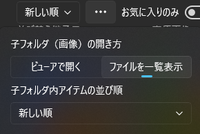

# ツバメビューアのトラブルシューティング

* [ツバメビューアの使い方](./how-to-use_ja)
* [ツバメビューア目安箱（バグ報告などの投稿フォーム）](https://forms.cloud.microsoft/Pages/ResponsePage.aspx?id=DQSIkWdsW0yxEjajBLZtrQAAAAAAAAAAAAZAAObntfNUNVdWMThSTjFGMDhFWjI4TDJLSjUxTTM4SC4u)

## Q. 複数ウィンドウでアプリやビューアを表示したい

* ビューアで開けるアイテムのアイテムメニューから「新しいウィンドウで開く」を選択する
* または、アプリ設定から「別ウィンドウにビューアを表示する」をオンに設定した状態でビューアを開く

## Q. 開いたフォルダに画像しか表示されない（フォルダや動画、小説ファイルが表示されない）

A. 画面右上から「画像ビュー」を「フォルダビュー」に切り替えてみてください

## Q. フォルダのサムネイル画像が表示されない

以下のいずれかをお試しください

* ページを再読み込み（アプリメニューの更新アイコン）する。または、別のフォルダを一覧表示として開いてからもう一度元のフォルダを開く
* フォルダアイテムのメニューから「サムネイル画像を再読み込み」を選択する
  * 内部データを破棄して読み込みます。フォルダのカバー画像として
* 画像一覧または画像ビューアを開いて、任意の画像をサムネイル画像に指定する（指定するとそのフォルダにcover.jpgが出力されます）

内部動作としては

1. gif画像ならファイルを開く
2. アプリローカルの画像キャッシュがあれば開く
3. ファイルシステム経由でサムネイル画像が取得できれば開く
4. 画像ファイルからサムネイル画像を作成して開く

設定によっては 3 をスキップできます（アプリ設定の「サムネイル画像のキャッシュ生成」から変更可能です）

## Q. 子フォルダを画像一覧として開くようにしたい

フォルダオプション（フォルダ一覧画面の上部にある３つ点アイコンとして表示されるボタン）から「子フォルダ（画像）の開き方」を「ファイルを一覧表示」に指定すると画像一覧で表示できます

画像一覧を開いたあとで「フォルダビュー」を手動で選択した場合は、その後も「フォルダビュー」で表示されます。再度画像一覧で表示したい場合はフォルダ一覧ページの右上から「画像ビュー」を選択してください。

## Q. ファイル名に含まれる数字の桁揃えを自動で補完・補正してほしい

A. ツバメビューアでは対応していません。以下から手動補正についてご紹介します。

### 桁揃えの補正はPowerToysアプリに含まれるPower Renameを利用いただくことを推奨しています。

[PowerRename 用の Windows ユーティリティ](https://learn.microsoft.com/ja-jp/windows/powertoys/powerrename)

[PowerToysのストアページを開く](https://apps.microsoft.com/detail/xp89dcgq3k6vld)

PowerRenameは正規表現（文字列の検索条件を記述するもの）を使った置換に対応しており、置換前と後のプレビュー表示もあるので安心してファイル名の置換作業を進められます。

特に正規表現を知らなくても、チャットAIにご自身で変更したいファイル名を元にリネーム用の正規表現を作成を指示することで実現可能です。

[GeminiによるPowerRename用の正規表現を生成する質問と回答の例はこちら](https://share.gemini.google/cNxMpFop8VIG)

#### フォルダを無圧縮zipにパッケージ化する方法

エクスプローラーでフォルダを右クリックして「圧縮先…」 → 「追加オプション」を選択して圧縮の詳細を表示します。

以下のオプションを指定して、「作成」を選択すると無圧縮zipファイルに変換できます

* アーカイブ形式：ZIP
* 圧縮方法：Store（無圧縮）

## Q. 圧縮ファイルの文字化けを自動で修正して表示してほしい

A. ツバメビューアでは対応していません。

## Q. 【動画ビューア】プレビュー画像が表示されない・表示に時間が掛かる

一部のエンコードの種類においてプレビュー画像生成に失敗するケースがあります。

* av1 
* mpeg2

ユーザー側で可能な対策は、動画を汎用的な動画コーデック（h264）に再エンコードいただくと確実です。

> 最速でのプレビュー画像生成はffmpegによるものです。ffmpegでのプレビュー画像生成に失敗した場合に、UWP組み込みの動画編集機能にフォールバックしてプレビュー画像生成を試みます。成功した場合は、低速ながらプレビュー画像が表示できます。

> アプリ側が対応することで改善の可能性があります。ffmpegライブラリの機能更新に追従してアプリをアップデートする場合で解決するケースもあります。この場合はアプリ更新履歴などで告知します。

## Q. 【動画ビューア】１フレーム進む・１フレーム戻る操作が画面に反映されない

FFmpegを利用して再生している場合にこの問題が発生することがあるようです。

動画ビューア設定（コントロールUIの右下にある歯車アイコンのボタン）から「FFmpegを優先して再生する」のチェックを無効に切り替えて再生することで１フレーム単位の操作が画面に反映されます。（ただし、mp4動画ファイルなどWindowsが標準対応している動画形式に限る）

それ以外についてはアプリ更新によってFFmpegのバージョンアップが入ったタイミングで修正されていないかご確認ください。

タブレット端末など映像処理の能力が限定的な場合に表示反映が即時的でない場合がありますが、そのケースについては現状ではアプリとして対応していません。

